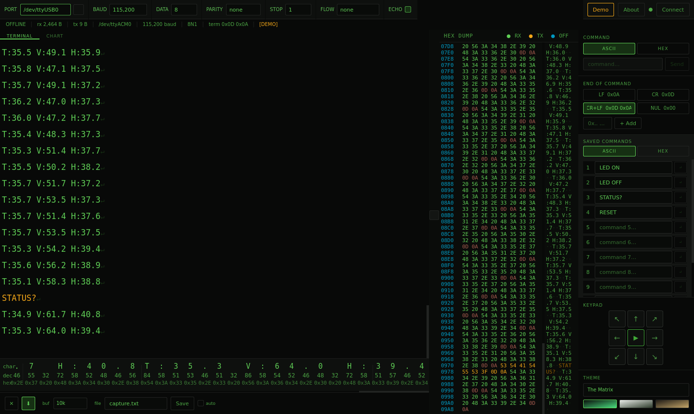
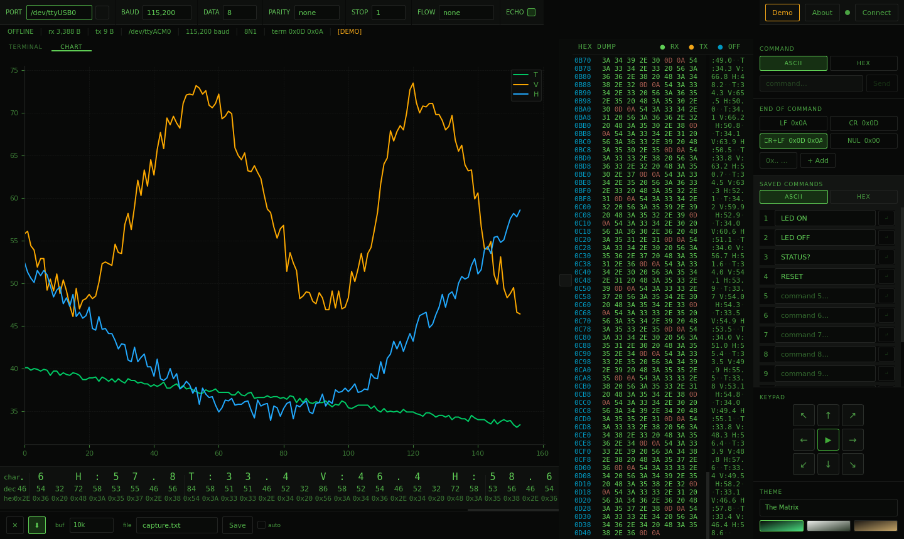

# Taller5 Serial Terminal

**A desktop serial terminal made for learning embedded systems: see every byte your
microcontroller sends, in text, hex and decimal, and plot its data live without
writing any extra tools.**

[](LICENSE)


[](https://github.com/namontoy/Taller5-Terminal/actions/workflows/smoke.yml)



---

## Why this terminal?

When you start working with UARTs, the usual tools show you *text*, but what
travels on the wire is *bytes*. A missing `\r`, a stray `0x00`, a wrong baud
rate or a sign error in a `printf` are hard to spot when all you see is a line
of characters.

This terminal is built around a few ideas:

- **Show the bytes, not just the text.** Every received character appears at
  the same time in the terminal, in a hex dump and in an ASCII strip showing
  the character, its decimal value and its hex value. Control characters show
  up by name (`[ESC]`, `[BEL]`…) instead of disappearing.
- **Tell what you sent apart from what you received.** Your own commands are
  shown in a different color (amber) everywhere, or can be hidden completely
  with the **ECHO** switch when the device already echoes them back.
- **Plot data with zero effort.** Print `T:23.5 V:3.28` from your
  microcontroller and it appears as a live chart. No Python script, no
  spreadsheet.
- **Repeat work without retyping.** 12 saved ASCII commands and 12 saved HEX
  frames, a directional keypad, and configurable line endings.
- **Work without hardware.** A **Demo** mode generates realistic sensor data so
  you can explore the interface (or prepare a class) with no board connected.

---

## Main features

| | |
|---|---|
| **Serial connection** | Any baud rate from 300 to 921 600, 5–8 data bits, parity, 1/1.5/2 stop bits, RTS/CTS or XON/XOFF flow control. Automatically detects USB-serial adapters and boards (`/dev/ttyUSB0`, `COM3`, `/dev/cu.usbserial-…`). |
| **Terminal** | Received text with visible line endings (`↵`) and named control characters; sent commands in amber; auto-scroll you can pause to read. |
| **Hex dump** | Collapsible panel with offset, hex bytes and ASCII columns, color-coded RX / TX / control bytes. Copy only the hex values with a selection or right-click → *Copy all bytes as hex*. |
| **ASCII strip** | The most recent characters, each shown as character, decimal and hex. Useful for learning the ASCII table. |
| **Live chart** | Up to 8 signals, 200-point rolling window, parsed automatically from `key:value`, `key=value` or CSV lines. |
| **Command sending** | ASCII or HEX mode, selectable line endings (LF, CR, CR+LF, NUL or custom), 12 + 12 saved commands, 8-direction keypad plus START/STOP. |
| **Local echo switch** | Show or hide your own commands. Turn it off when the device echoes, so lines don't appear twice. |
| **Capture to file** | Save the buffer as text, or save automatically to a timestamped file every time the app closes. |
| **Three themes** | *The Matrix* (green on black), *Light* and *Matte*. |
| **Remembers everything** | Port, speed, theme, saved commands and options are restored on the next launch. |
| **Automated tests** | Port-detection unit tests for Linux, Windows and macOS, plus a start-up smoke test (opens the window, runs demo data, checks local echo, the "no port" message and every theme). GitHub Actions runs them on all three systems after every push. Run them locally with `python -m unittest discover tests` and `python tests/smoke_test.py`. |



---

## Installation

### Platform support

| System | Status |
|---|---|
| **Linux** (Ubuntu, Linux Mint) | Developed and tested with real hardware. |
| **Windows**, **macOS** | Supported, community-tested. Every push is checked automatically on both (the *smoke test* badge above): the app installs, starts, lists ports the way each system names them and runs in demo mode. Real-hardware reports from users are welcome. |

Windows or macOS problems are almost always about the USB driver or another
program holding the port. See the Windows and macOS notes in
[INSTALL.md](INSTALL.md#windows).

### Quick install

Short version (you need [Miniconda](https://docs.conda.io/en/latest/miniconda.html)
or Python 3.12):

```bash
git clone https://github.com/namontoy/Taller5-Terminal.git
cd Taller5-Terminal

conda create -n taller5 python=3.12 -y
conda activate taller5
pip install -r requirements.txt

python main.py
```

On **Windows**, run these commands in the *Anaconda Prompt*.

> **Linux users:** two one-time steps are required before the terminal can open
> a port: install the Qt system libraries, and add yourself to the `dialout`
> group (`sudo usermod -aG dialout $USER`, then **log out and back in**).
> Without the second step the port shows up in the list, but **Connect** fails
> with `Permission denied`.

**[INSTALL.md](INSTALL.md)** has the complete guide: an Ubuntu 24.04 checklist,
an option without conda (venv), the fix for USB adapters that disappear
(`brltty`), and a troubleshooting table.

---

## Getting started

### 1. Try it without hardware

Click **Demo** in the top bar. The terminal starts receiving lines like
`T:47.9 V:66.9 H:50.6`. Open the **CHART** tab to watch them plotted, and look at
the hex dump and ASCII strip to see the same data as bytes. Click **Demo** again
to stop.

### 2. Connect to your board

1. Plug in the board or USB-serial adapter.
2. Choose it in **PORT** (click **↺** to rescan if you plugged it in after starting the app).
3. Set **BAUD** to the same value as your firmware (for example `115200`).
   Most boards use `8`, `none`, `1` (8N1), which is the default.
4. Click **Connect**. The dot turns on, the button turns red and reads
   **Disconnect**, and the status bar shows `CONNECTED`.

If you see unreadable characters, the baud rate almost always doesn't match.

### 3. Send commands

- Type in **COMMAND** and press **Enter** (or click **Send**).
- Choose the line ending in **END OF COMMAND**. It must match what your firmware
  expects. `CR+LF` is the default; many parsers only need `LF` or `CR`.
- Switch to **HEX** to send raw bytes: type `AA 55 01` (or C-style `0xAA 0x55 0x01`)
  and exactly those three bytes are sent (plus the selected line ending).

### 4. Save the commands you use often

In **SAVED COMMANDS**, type into any of the 12 slots (ASCII or HEX tab). It's
saved automatically. Click **↵** next to a slot to send it. The panel scrolls
when the slots don't fit.

### 5. Echo on or off?

With **ECHO** checked (default), everything you send also appears in amber. If
your firmware already sends each command back, you'll see it twice; uncheck
**ECHO** and only what the device sends is shown.

---

## Plotting data from your microcontroller

The chart reads every complete line (ending in `\n`) and extracts the numbers
from it. Lines without numbers are ignored, so you can freely mix data with
messages like `System ready`.

| Your line | Signals plotted |
|---|---|
| `T:23.5 V:3.28 H:61.4` | `T`, `V`, `H` (recommended: self-describing) |
| `rpm=1500 duty=42` | `rpm`, `duty` |
| `23.5,3.28,61.4` | `0`, `1`, `2` (by column) |
| `23.5;3.28` or `23.5 3.28` | `0`, `1` |
| `T:23.5 status=OK count:42` | `T`, `count` (non-numeric `status` is skipped) |

Numbers can be integers, decimals or scientific (`-0.7`, `1.5e-3`). Names are
case-sensitive (`Temp` ≠ `temp`). At most 8 signals; each keeps its last 200
points.

**STM32 (HAL)**

```c
char msg[48];
int n = snprintf(msg, sizeof msg, "T:%d ADC:%lu\r\n", temp_c, adc_value);
HAL_UART_Transmit(&huart2, (uint8_t *)msg, n, HAL_MAX_DELAY);
```

> With `newlib-nano`, `%f` prints nothing unless you enable float support
> (linker flag `-u _printf_float`, or the option in STM32CubeIDE). Sending
> integers, or scaled values such as millivolts, avoids the issue.

**Arduino**

```cpp
Serial.print("T:");  Serial.print(temperature, 1);
Serial.print(" V:"); Serial.println(voltage, 2);    // → T:23.5 V:3.28
```

**MicroPython**

```python
print(f"T:{temperature:.1f} V:{voltage:.2f}")
```

---

## Interface reference

```
┌───────────────────────────────────────────────────────────────────────────────┐
│ PORT  BAUD  DATA  PARITY  STOP  FLOW  ECHO □          Demo  About  ● Connect  │  toolbar
│ OFFLINE │ rx 0 B │ tx 0 B │ /dev/ttyUSB0 │ 115,200 baud │ 8N1 │ term 0x0D 0x0A │  status bar
├─────────────────────────────────────────────┬──────────────┬──────────────────┤
│ TERMINAL | CHART                            │  HEX DUMP    │ COMMAND          │
│                                             │  (<< / >>)   │ END OF COMMAND   │
│                                             │              │ SAVED COMMANDS   │
├─────────────────────────────────────────────┤              │ KEYPAD           │
│ ASCII strip: char / dec / hex               │              │ THEME            │
├─────────────────────────────────────────────┤              │                  │
│ ✕  ⬇  buf 10k  file capture.txt  [Save]  □ auto                              │  bottom bar
└─────────────────────────────────────────────┴──────────────┴──────────────────┘
```

### Toolbar

| Control | What it does |
|---|---|
| **PORT** / **↺** | Detected serial ports. Linux: `ttyUSB*`, `ttyACM*`, `ttyAMA*`, `ttyXRUSB*`, `rfcomm*`. Windows: `COM1`, `COM3`… macOS: `/dev/cu.*` (hover to see a long name in full). ↺ rescans. |
| **BAUD, DATA, PARITY, STOP, FLOW** | Frame settings. Locked while connected. |
| **ECHO** | Show sent commands in the terminal, hex dump, ASCII strip and saved files. Can be changed at any time. |
| **Demo** | Simulated sensor stream (`T`, `V`, `H` sine waves with noise). Not available while connected. |
| **About** | Version information. |
| **Connect / Disconnect** | Open or close the port. |

### Status bar

Connection state · bytes received (`rx`) · bytes sent (`tx`) · port · baud ·
frame format (e.g. `8N1`) · active line endings (`term`) · `[DEMO]` while demo
mode runs.

### Terminal

| Look | Meaning |
|---|---|
| Normal color | Received bytes |
| Amber | Bytes you sent (local echo) |
| Dim amber `[NAME]` | Control characters, e.g. `[ESC]`, `[BEL]` |
| Dim `↵` | End of line |

Click **⬇** in the bottom bar to pause auto-scroll and read calmly while data keeps
arriving. Click it again, or drag the scrollbar back to the bottom, to resume.

### Hex dump

Click **>>** / **<<** to open or close it. Each row shows the offset, 8 bytes in
hex and their ASCII form (`·` for non-printable bytes). Colors: **RX** received,
**TX** sent, **OFF** offsets; control bytes are highlighted. Selecting and
copying (Ctrl+C) copies only the hex values; right-click → **Copy all bytes as
hex** copies the whole buffer as `48 65 6C 6C 6F …`.

### Sidebar

| Section | What it does |
|---|---|
| **Command** | Type and send. ASCII mode sends the text; HEX mode sends bytes and formats your input as you type (`aa5501` → `AA 55 01`); C-style `0xAA 0x55` is accepted too. |
| **End of command** | Bytes appended to every command: `LF 0x0A`, `CR 0x0D`, `CR+LF`, `NUL 0x00`. Several can be active. **+ Add** creates a custom one (a character such as `@`, or a code such as `0x03`); **×** removes it. |
| **Saved commands** | 12 ASCII + 12 HEX slots, saved automatically. **↵** sends a slot. Enabled only while connected. |
| **Keypad** | Arrows send `DIR:N`, `DIR:NE`, `DIR:E`, … `DIR:NW`; the center button alternates `START` / `STOP`. The selected line ending is appended. Handy for robots, CNC and motor labs. |
| **Theme** | *The Matrix*, *Light* or *Matte*. |

### Bottom bar

| Control | What it does |
|---|---|
| **✕** | Clear terminal, chart, hex dump, ASCII strip and the rx/tx counters. |
| **⬇** | Pause / resume auto-scroll. |
| **buf** | How many characters to keep: 1k, 5k, 10k or 50k. Older data is discarded. |
| **file** + **Save** | Write the current buffer as text to that file name, in the folder the app was started from. An existing file with that name is overwritten. |
| **auto** | On close, save the buffer to a new timestamped file, e.g. `capture_230926_143022.txt`. Never overwrites. |

---

## Where things are stored

| What | Location |
|---|---|
| Settings (port, theme, saved commands…) | `~/.config/serial_terminal/config.json` (Windows: `%USERPROFILE%\.config\serial_terminal\config.json`). Delete it to reset everything. |
| Application log | `~/.config/serial_terminal/logs/serial_terminal.log` (Windows: under `%USERPROFILE%\.config\…` too). **Check it first if something goes wrong.** |
| Captures | The folder you started the app from. |

---

## How it's built

A small, readable PyQt6 application, suitable as an example of a real desktop
tool:

- **Serial I/O runs in a separate thread** (`QThread` + pyserial), so the
  interface never freezes while waiting for data.
- **Rendering is throttled**: the terminal, hex dump, ASCII strip and chart
  each redraw at a fixed rate (50–250 ms), not on every byte. This kept the app
  running for more than 15 hours on a continuous stream at 4 lines/s without
  slowing down.
- **Crash safety**: unhandled errors are logged instead of silently closing the
  app.

```
Taller5-Terminal/
├── main.py                    Entry point
├── requirements.txt           PyQt6, pyserial, matplotlib
├── INSTALL.md                 Installation guide and troubleshooting
├── docs/                      Screenshots
├── tests/                     Port-detection unit tests + start-up smoke test
├── .github/workflows/         Automatic checks on Linux, Windows and macOS
└── serial_terminal/
    ├── main_window.py         Main window, wiring between widgets, demo mode
    ├── serial_worker.py       Serial port thread
    ├── config.py              Settings load/save
    ├── themes.py              Color themes and stylesheet
    ├── logging_setup.py       Log file and error handlers
    └── widgets/
        ├── toolbar.py         Port settings, ECHO, Connect
        ├── status_bar.py      Connection statistics
        ├── terminal_view.py   Text terminal
        ├── hex_panel.py       Hex dump
        ├── ascii_strip.py     char / dec / hex strip
        ├── chart_panel.py     Live chart (matplotlib)
        ├── sidebar.py         Commands, line endings, saved commands, keypad, theme
        └── bottom_bar.py      Clear, scroll, buffer, save
```

---

## License

[MIT](LICENSE) © 2026 Nerio Andrés Montoya G. Free to use, modify and share in
your courses and projects.
